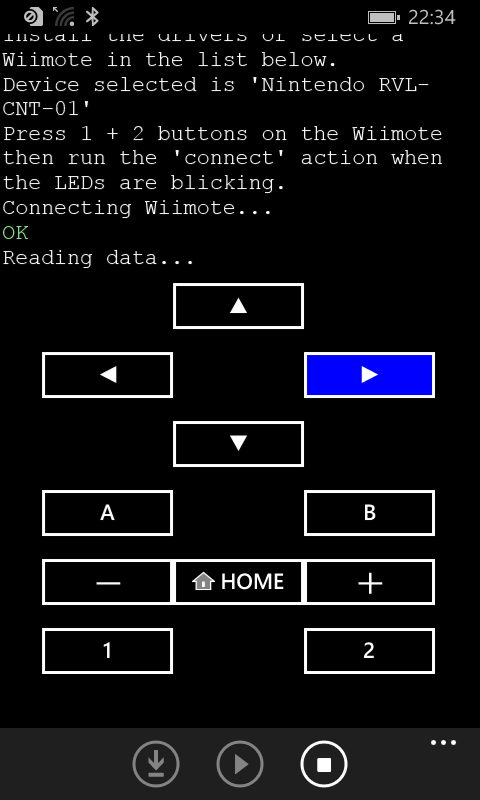

# wp81WiimoteDriver
Windows Phone 8.1 driver for Nintendo Wiimote.

This application demonstrates a way to connect and communicate with a Wiimote from a Lumia 520.

## Install the required drivers

From the application, press the 'install' button.

## Pair a Wiimote

From the Bluetooth settings of the Lumia 520, pair a Wiimote with the pin "---".  
You have to press the buttons 1 + 2 of the Wiimote in order to enter the 'discovery' mode.
A filter driver will intercept this pin code and replace it by the Bluetooth address of the wiimote as expected by it.  

> [!NOTE]
> Without pairing the Wiimote is disconnected by Windows after around 60 secondes.

## Connect the Wiimote

From the application, select the Wiimote in the available Bluetooth devices.  
Then follow the instructions displayed by the application.

## Requirements

Only original Wiimote (no third party) can be discovered by Windows.

Compilation requires Visual Studio 2015 with Windows Phone 8.1 support.

Execution requires Nokia Lumia 520 with Windows Phone 8.1 rooted with [WPinternals](https://github.com/ReneLergner/WPinternals).
